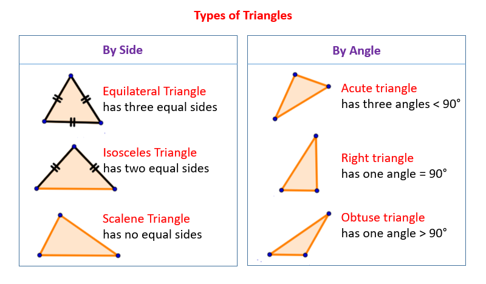

# Triangle Tracker

## Description

Triangle tracker is used to identify  the type of triangle whenever we key in a value in the input boxes as shown on the page. It has listed the types of triangles to help us figure out the type as we key in.
;

## Setup Instructions

All you need is to insert your figures on the input box then click on the type of triangle button right below the input boxes and examine what happens.

## BDD

When you visit my site, all you need to do is to input your values in the spaces provided, when you click on the type of triangle button, you will see your results below the button indicating the results of your input. for example when you insert values like 4,4,4 the results will be equilateral triangle and it will be indicated below the type of triangle button.

## Author Information

The project is written by Oscar Ngolo, a Junior web developer of Moringa School pursuing a certificate in website design management.

## Technology used

The project is using a Javascript programming language.

## Contact Information

Oscar Ngolo, Tel: 0707337751.

## License

MIT
